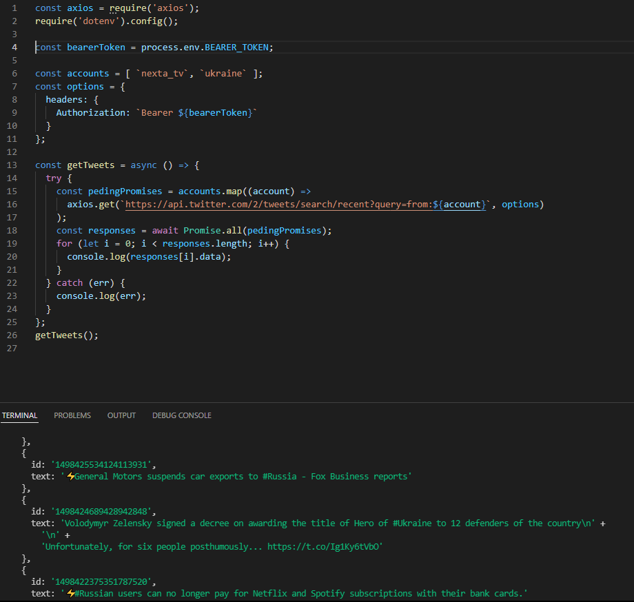
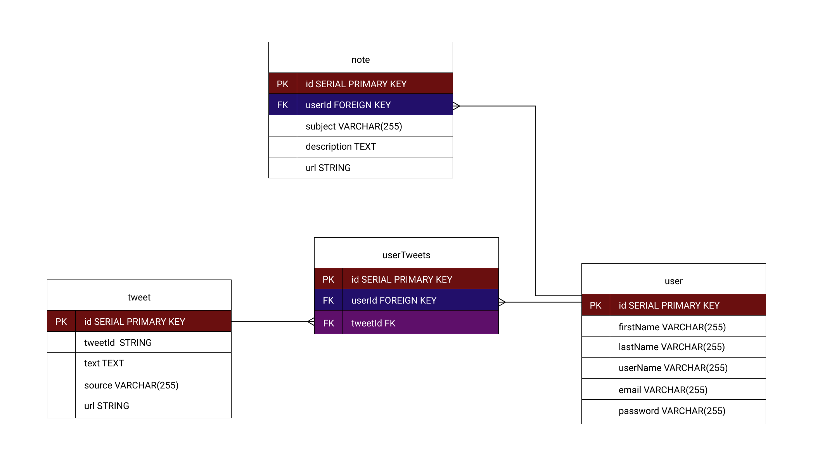
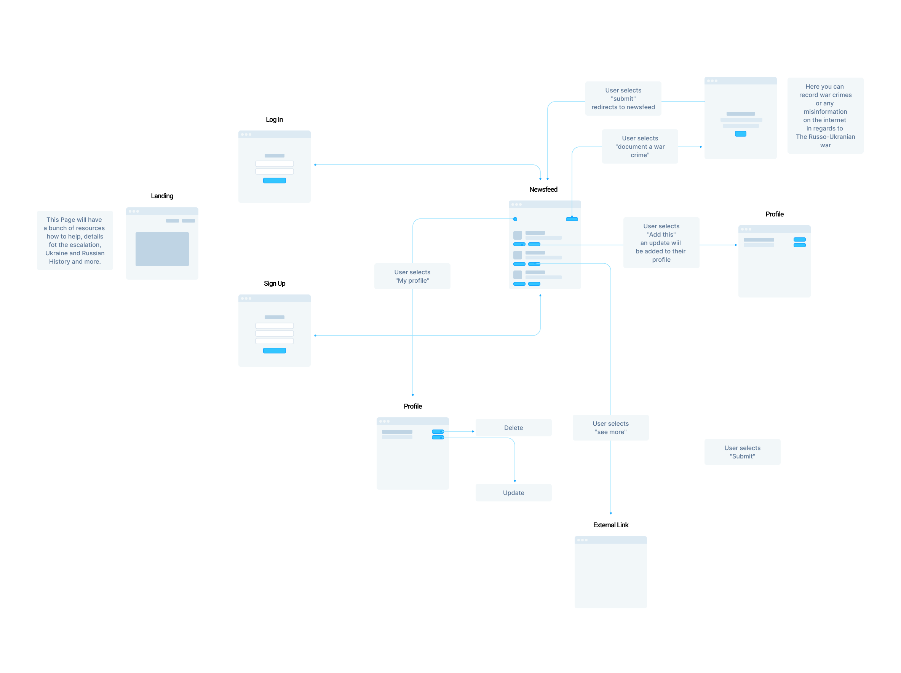

# The Russo-Ukrainian War Updates
https://ukraine-war-updates.herokuapp.com/

## Project Idea/Description 

With this project I want to highlight and update people on what is going on in Ukraine. During these times it is very important to document war crimes against Ukranian people by their opposition and stop misinformation from spreading on the media. This webapp serves as a tool for people to document The Russo-Ukranian war as it unfolds. A user will be able to browse through latest updates on the war and document war crimes as well as misinformation and save tweets to their profle.

## Website Functionality

To get access to user newsfeed please sign up first!

## Installation 
1. `Fork` and `clone` repo [UkraineUpdates](https://github.com/romanprotoliuk/ukraineUpdates)
2. Sign up for twitter Developer [account](https://developer.twitter.com/en)
3. Run `npm install` to install all dependencies 
4. `touch .env .gitignore` files (really important to add your `.env` file to `.gitignore` right away!)
5. Paste your `API_KEY`, `API_KEY_SECRET`, `BEARER_TOKEN`, `ACCESS_TOKEN`, `ACCESS_TOKEN_SECRET` from twitter developer portal to you env file
6. Create a `SECRET` key for cookies in your env file
7. CREATE a `PORT` key you want your app to run in locally and paste in in your env file
8. Set up postgres database 
9. Create a database named `ukrainenews` by running `create database ukrainenews` in your postgres terminal for WSL, or alternatively run `createdb ukrainenews` on MAC
10. Run `sequelize db:migrate` to run migrations 
11. Run `nodemon` to start your application. If you haven't installed it, run `npm install -g nodemon` to install it globally

## Tech Stack
* Postgres
* Express
* Node
* Vanilla JavaScript
* EJS
* CSS 

## Choice of API
Most of the data for this app will be pulled form Twitter APIv2, from my experience it has been an effective source especially when it comes to live updates. For this project it will be extremly important to use verified acount tweets.

https://developer.twitter.com/en

### Valid API Proof

### ERD

## Restful Routing Chart

| Method | Path | Purpose |
| ------ | -------------- | -------------------------------- |
| GET | `/` | home page of the website |
| GET | `/signup` | signup page of the website |
| POST | `/signup` | signup for the website |
| GET | `/login` | login page of the website  |
| GET | `/users/profilejournal/:id` | profile page that displays user journal section of the website  |
| GET | `/users/profiletweets/:id` | profile page that displays user saved tweets section of the website  |
| DELETE | `/users/:noteid` | delete saved note from profile  |
| DELETE | `/users/tweet/:tweetid` | delete saved tweet from profile  |
| PUT | `/users/edit/:noteId` | edit saved note from profile  |
| GET | `/users/newsfeed` | newsfeed page of the website |
| POST | `/users/noteform` | add note to user profile |
| POST | `/users/add-tweet` | add tweet to user profile |
| GET | `/noteform` |  note form page of the website |

## Wireframes of all user views

## User Stories
* As a user, I want to sign up for a profile 
* As a user, I want to sign out of my profile 
* As a user, I want to see all important update on The Russo-Ukrainian War
* As a user, I want to document a war crime and I want it to show up on my profile 
* As a user, I want to see full article detail from it's original source 
* As a user, I want to delete any notes I made on any articles 
* As a user, I want to edit any notes I made on any articles 

## MVP goals 
- [x] Authentication 
- [x] Twitter API successfully working 
- [x] Newsfeed page
- [x] Document war crimes form working 
- [x] Notes showing up in my profile page
- [x] Delete/Edit notes

## Stretch goals 
- [ ] Implement multiple sources of API, Twitter, Reddit, News 
- [ ] Filter them out 
- [ ] For each API show what source they've been pulled from 
- [ ] Implement image upload for notes

## Improvements Reflection
* make about route where I talk about why I did this project and details of the conflict
* casualties updates - scrape news wesbite for this
* live tweet apears on newsfeed
* join table implementation 
* responsivness 
* error handling 
* form validation 

## Takeaways
* even though I was in docs alot I feel like I need to spend more time going over docs
* learned client / server side difference
* working with queries 
* importance of structuring my app and have a clear road map before I start coding  
* working with databases - I'm still in the process of understanding things better
